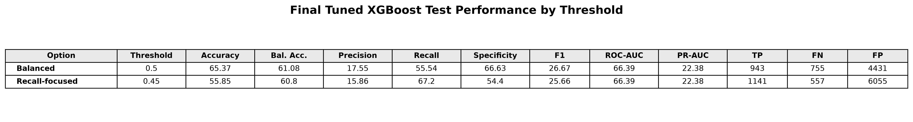
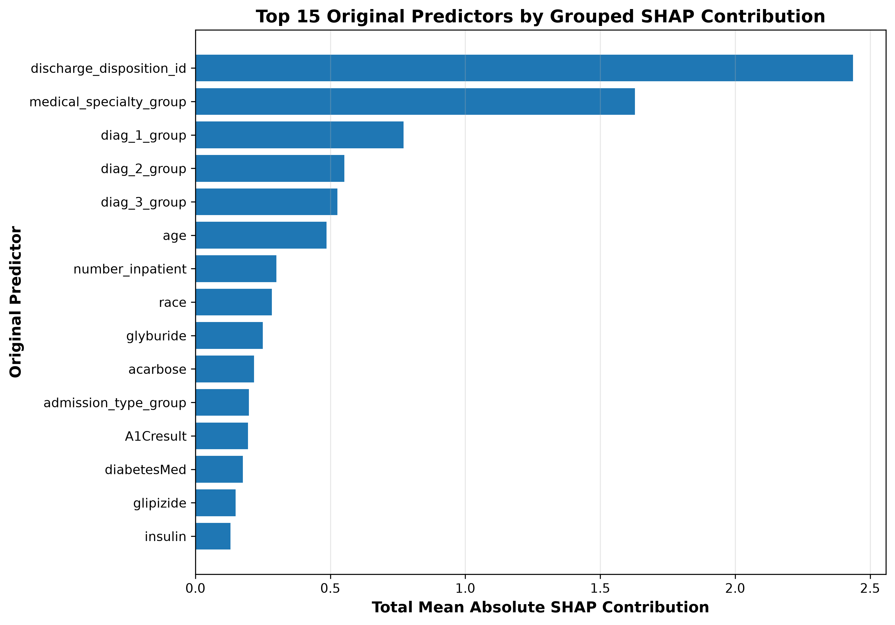

# AI-Powered Hospital Readmission Risk Prediction

[](#project-status)
[](#project-overview)
[](#final-model)
[](#streamlit-application)
[](#model-explainability)

A complete machine-learning capstone project for estimating the probability of **30-day hospital readmission** among patients with diabetes. The project covers data auditing, leakage-safe patient-level splitting, preprocessing, baseline and advanced model comparison, hyperparameter tuning, threshold analysis, final untouched test-set evaluation, explainable AI, and a CSV-based Streamlit prediction application.

> **Important:** This repository is an academic decision-support prototype. It is not a medical device, does not provide a diagnosis, and must not be used as the sole basis for patient-care decisions.

---

## Table of Contents

1. [Project Overview](#project-overview)
2. [Project Status](#project-status)
3. [Key Results](#key-results)
4. [Business Problem](#business-problem)
5. [Dataset](#dataset)
6. [Target Definition](#target-definition)
7. [Methodology](#methodology)
8. [Leakage Prevention](#leakage-prevention)
9. [Preprocessing Pipeline](#preprocessing-pipeline)
10. [Model Development](#model-development)
11. [Final Model](#final-model)
12. [Final Test Results](#final-test-results)
13. [Threshold Strategy](#threshold-strategy)
14. [Model Explainability](#model-explainability)
15. [Streamlit Application](#streamlit-application)
16. [CSV Prediction Workflow](#csv-prediction-workflow)
17. [Installation and Local Execution](#installation-and-local-execution)
18. [Project Structure](#project-structure)
19. [Notebook-by-Notebook Summary](#notebook-by-notebook-summary)
20. [Important Artifacts](#important-artifacts)
21. [Reproducibility and Validation](#reproducibility-and-validation)
22. [Limitations](#limitations)
23. [Responsible Use](#responsible-use)
24. [Future Enhancements](#future-enhancements)

---

## Project Overview

**Course:** ASDS 6306 Capstone  
**Project:** Hospital Readmission Risk Prediction  
**Prediction point:** At or near hospital discharge  
**Prediction target:** Readmission within 30 days  
**Final model:** Tuned XGBoost  
**Application:** Streamlit dashboard with CSV-based single-record and batch prediction  
**Explainability:** Global and example patient-level SHAP analysis  

The project was designed to answer the following question:

> Can routinely available hospital encounter information be used to identify encounters that may require additional post-discharge review because of an elevated model-estimated probability of readmission within 30 days?

The project does not optimize for accuracy alone. Because only about 11% of encounters belong to the positive class, the analysis emphasizes recall, precision, F1-score, balanced accuracy, ROC-AUC, PR-AUC, confusion-matrix counts, and the operational cost of false-positive and false-negative decisions.

---

## Project Status

| Component | Status |
|---|---|
| Data audit and cleaning | Completed |
| Exploratory data analysis | Completed |
| Patient-level splitting | Completed |
| Preprocessing definition and validation | Completed |
| Baseline model evaluation | Completed |
| Candidate model evaluation | Completed |
| Hyperparameter tuning | Completed |
| Threshold analysis | Completed |
| Final model and threshold selection | Completed |
| Untouched test-set evaluation | Completed |
| Explainable AI analysis | Completed |
| Streamlit dashboard | Completed |
| CSV prediction workflow | Completed |
| GitHub repository | Completed |

---

## Key Results

- Final cleaned dataset: **99,343 encounters × 46 columns**
- Unique patients: **69,990**
- Positive class rate: **11.39%**
- Modeling predictors: **43**
  - 8 numeric
  - 35 categorical
- Transformed model features: **179**
- Patient overlap across train, validation, and test: **0**
- Final model: **Tuned XGBoost**
- Main operating threshold: **0.50**
- Recall-focused screening threshold: **0.45**
- Final test encounters: **14,976**
- Final test readmissions: **1,698**
- Main threshold recall: **55.54%**
- Recall-focused threshold recall: **67.20%**
- Lowering the threshold from 0.50 to 0.45:
  - caught **198 additional readmissions**
  - reduced false negatives by **198**
  - produced **1,624 additional false-positive alerts**

---

## Business Problem

Hospital readmissions may increase healthcare costs and can indicate that a patient requires additional follow-up, medication review, discharge support, or care coordination.

The objective is not to replace clinical decision-making. The model is intended to support prioritization by estimating readmission probability and flagging encounters for possible additional review.

A useful screening model must balance two competing goals:

1. Detect as many actual readmissions as reasonably possible.
2. Avoid creating an unmanageable number of false-positive alerts.

This trade-off is why the final application presents two operating thresholds rather than a single universal classification rule.

---

## Dataset

**Dataset:** Diabetes 130-US Hospitals for Years 1999–2008  
**Source organization:** UCI Machine Learning Repository  
**Unit of analysis:** One hospital encounter  

### Original data

| Characteristic | Value |
|---|---:|
| Encounters | 101,766 |
| Columns | 50 |
| Unique patients | 71,518 |
| Exact duplicate rows | 0 |
| Maximum encounters for one patient | 40 |

### Final audited modeling data

| Characteristic | Value |
|---|---:|
| Encounters | 99,343 |
| Columns | 46 |
| Unique patients | 69,990 |
| Patients with multiple encounters | 16,341 |
| Missing values | 0 |
| Positive encounters | 11,314 |
| Negative encounters | 88,029 |
| Positive class rate | 11.39% |

### Exclusions

A total of **2,423 encounters** associated with expired or hospice discharge dispositions were removed because they were not suitable candidates for standard 30-day readmission prediction.

The excluded discharge disposition codes were:

- 11: Expired
- 13: Hospice/home
- 14: Hospice/medical facility
- 19: Expired at home
- 20: Expired in a medical facility
- 21: Expired, place unknown

---

## Target Definition

The original `readmitted` field contained:

- `NO`
- `>30`
- `<30`

A binary target named `readmitted_30` was created:

| Original value | Binary target |
|---|---:|
| `<30` | 1 |
| `>30` | 0 |
| `NO` | 0 |

The positive class therefore represents an encounter followed by readmission within 30 days.

The following fields were excluded from model predictors:

- `encounter_id`
- `patient_nbr`
- `readmitted_30`

`encounter_id` is used only for tracking. `patient_nbr` is used only for patient-level grouping and leakage prevention.

---

## Methodology

The end-to-end workflow was:

```text
Raw data
   ↓
Data audit and cleaning
   ↓
Target creation and feature engineering
   ↓
Exploratory data analysis
   ↓
Patient-level train / validation / test split
   ↓
Training-only preprocessing fit
   ↓
Baseline model comparison
   ↓
Candidate and advanced model comparison
   ↓
Hyperparameter tuning
   ↓
Validation-based threshold analysis
   ↓
Final model and threshold selection
   ↓
One-time untouched test evaluation
   ↓
SHAP explainability
   ↓
Streamlit deployment
```

### Evaluation priorities

Because of class imbalance, the following metrics were reviewed together:

- Recall / sensitivity
- Precision
- F1-score
- Specificity
- Balanced accuracy
- ROC-AUC
- PR-AUC
- True positives
- False positives
- False negatives
- True negatives

Accuracy was retained as a descriptive metric but was never used alone for model selection.

---

## Leakage Prevention

Repeated encounters from the same patient created a major leakage risk.

### Repeated-patient audit

- Unique patients: **69,990**
- Patients with multiple encounters: **16,341**
- Percentage of patients with repeated encounters: **23.35%**
- Encounters belonging to repeat patients: **45,694**
- Percentage of encounters from repeat patients: **46.00%**
- Maximum encounters for one patient: **40**

A random row-level split could place one encounter from a patient in training and another encounter from the same patient in validation or test. This could produce overly optimistic performance.

### Patient-level split

| Split | Encounters | Patients | Positive cases | Positive rate |
|---|---:|---:|---:|---:|
| Train | 69,467 | 48,993 | 7,936 | 11.424% |
| Validation | 14,900 | 10,498 | 1,680 | 11.275% |
| Test | 14,976 | 10,499 | 1,698 | 11.338% |

### Leakage audit

```text
Train vs. validation patient overlap: 0
Train vs. test patient overlap: 0
Validation vs. test patient overlap: 0
```

The exact split assignments were saved and reused throughout the remaining notebooks. The test set was reserved until the final model and threshold strategy were approved.

---

## Preprocessing Pipeline

### Numeric predictors

The eight numeric predictors are:

- `time_in_hospital`
- `num_lab_procedures`
- `num_procedures`
- `num_medications`
- `number_outpatient`
- `number_emergency`
- `number_inpatient`
- `number_diagnoses`

Numeric preprocessing:

1. Median imputation
2. Standard scaling

### Categorical predictors

Thirty-five categorical predictors were processed using:

1. Most-frequent imputation
2. Conversion to strings for consistent encoding
3. Rare-category grouping
4. One-hot encoding
5. Safe handling of previously unseen categories

### Rare-category rule

```text
Minimum frequency: 10 training observations
```

Rare-category decisions were learned using training data only.

### Feature expansion

| Stage | Feature count |
|---|---:|
| Raw predictors | 43 |
| Numeric transformed features | 8 |
| One-hot categorical features | 171 |
| Final transformed features | 179 |

The transformed matrices contained no missing, infinite, or invalid values.

### Custom transformer

`custom_transformers.py` contains the deployment-safe `RareCategoryGrouper` class required to load and reuse the serialized preprocessing pipeline.

---

## Model Development

### Baseline models

- Dummy Classifier
- Logistic Regression without class weighting
- Logistic Regression with balanced class weights
- Decision Tree with balanced class weights

The dummy model demonstrated the accuracy trap:

| Metric | Dummy result |
|---|---:|
| Accuracy | 88.72% |
| Recall | 0.00% |
| True positives | 0 |
| False negatives | 1,680 |

The model predicted every encounter as not readmitted. This established why accuracy alone was inappropriate.

The provisional baseline leader was class-weighted Logistic Regression:

| Metric | Validation result |
|---|---:|
| Accuracy | 66.98% |
| Balanced accuracy | 62.01% |
| Precision | 18.29% |
| Recall | 55.60% |
| F1-score | 27.52% |
| ROC-AUC | 66.94% |
| PR-AUC | 22.59% |

### Candidate models

The candidate stage evaluated stronger nonlinear and ensemble approaches, including:

- Random Forest
- Extra Trees
- HistGradientBoosting
- XGBoost
- CatBoost

These models were trained using the fixed training partition and evaluated on the validation partition. The reserved test set was not used for model comparison.

### Tuning and threshold analysis

Tuning was performed for the strongest candidate families. Thresholds were evaluated using validation probabilities rather than changing the underlying ranking model.

The selected tuned validation candidate was:

```text
Best Tuned XGBoost
Configuration: XGB_03_Deeper_Trees
Validation threshold: 0.50
```

Validation performance:

| Metric | Result |
|---|---:|
| Accuracy | 66.56% |
| Balanced accuracy | 63.15% |
| Precision | 18.70% |
| Recall | 58.75% |
| Specificity | 67.55% |
| F1-score | 28.37% |
| ROC-AUC | 68.07% |
| PR-AUC | 24.11% |
| True positives | 987 |
| False negatives | 693 |
| False positives | 4,290 |

### Advanced modeling

An additional advanced-modeling stage evaluated ensemble combinations as a robustness check. This work remained validation-only and did not access the test set.

Tuned XGBoost was selected as the final model because it provided a strong overall metric balance and the leading validation PR-AUC among the compared final candidates.

---

## Final Model

```text
Tuned XGBoost
```

The final production assets are:

```text
models/final_preprocessor.joblib
models/final_xgboost_model.joblib
artifacts/final_deployment_config.json
artifacts/streamlit_input_schema.json
```

The finalized prediction pipeline:

1. Accepts 43 raw predictors.
2. Applies the saved training-fitted preprocessor.
3. Produces 179 transformed features.
4. Generates a probability using `predict_proba`.
5. Applies the 0.50 and 0.45 operating thresholds.

No preprocessing rule is relearned inside the Streamlit application.

---

## Final Test Results

The final model was evaluated once on the previously untouched test set.

### Test-set characteristics

| Characteristic | Value |
|---|---:|
| Encounters | 14,976 |
| Positive cases | 1,698 |
| Negative cases | 13,278 |
| Positive rate | 11.338% |

### Final operating points

| Metric | Main balanced threshold | Recall-focused threshold |
|---|---:|---:|
| Threshold | 0.50 | 0.45 |
| Accuracy | 65.37% | 55.85% |
| Balanced accuracy | 61.08% | 60.80% |
| Precision | 17.55% | 15.86% |
| Recall | 55.54% | 67.20% |
| Specificity | 66.63% | 54.40% |
| F1-score | 26.67% | 25.66% |
| ROC-AUC | 66.39% | 66.39% |
| PR-AUC | 22.38% | 22.38% |
| Readmissions caught | 943 | 1,141 |
| Readmissions missed | 755 | 557 |
| False positives | 4,431 | 6,055 |
| True negatives | 8,847 | 7,223 |

### Final confusion matrices

Threshold 0.50:

```text
True negatives:  8,847
False positives: 4,431
False negatives:   755
True positives:    943
```

Threshold 0.45:

```text
True negatives:  7,223
False positives: 6,055
False negatives:   557
True positives:  1,141
```



---

## Threshold Strategy

The project intentionally presents two operating points.

### Main balanced threshold: 0.50

Use when the objective is a more balanced compromise between sensitivity and specificity.

- Recall: 55.54%
- Specificity: 66.63%
- Readmissions caught: 943
- False positives: 4,431

### Recall-focused screening threshold: 0.45

Use when missing a potential readmission is considered more costly and the operational setting can tolerate more follow-up alerts.

- Recall: 67.20%
- Specificity: 54.40%
- Readmissions caught: 1,141
- False positives: 6,055

### Trade-off

Lowering the threshold from 0.50 to 0.45:

- catches 198 additional readmissions
- reduces missed readmissions by 198
- creates 1,624 additional false-positive alerts

The two thresholds do not change ROC-AUC or PR-AUC because those metrics evaluate probability ranking across thresholds.

---

## Model Explainability

Explainability was completed after final test evaluation.

### Methods

- XGBoost feature importance
- Global SHAP importance
- Grouping transformed one-hot features back to original predictors
- Example local SHAP explanations for selected encounters

### Strongest global SHAP drivers

The leading original predictor groups included:

1. Discharge disposition
2. Medical specialty
3. Primary diagnosis group
4. Secondary diagnosis group
5. Additional diagnosis group
6. Age
7. Previous inpatient visits
8. Race
9. Glyburide status
10. Acarbose status



### Interpretation rules

- Global importance describes overall model behavior.
- A high global importance value does not imply causality.
- The sign and magnitude of a factor can differ between encounters.
- Demographic and clinical-category effects must be reviewed carefully for fairness and context.
- Saved local SHAP plots are examples and do not automatically explain a newly uploaded CSV row.

Explainability files are stored under:

```text
outputs/metrics/
outputs/figures/
```

---

## Streamlit Application

The final application is implemented in:

```text
app.py
```

### Application pages

- Project Overview
- Dataset Summary
- Model Development
- Final Evaluation
- Saved Figures
- Model Explainability
- Patient Risk Prediction

### Main application features

- Clickable sidebar navigation
- Cleaned-dataset summary
- Development-stage model comparison
- Final untouched test-set results
- Threshold interpretation
- Saved model-development, final-evaluation, and explainability figures
- Global SHAP-importance table
- Blank 43-column CSV template download
- Valid sample CSV download
- Single-record CSV prediction
- Batch CSV prediction
- Detailed input validation
- Downloadable prediction results
- Academic and clinical-use disclaimer

### Approved visualizations

The application includes approved figures from:

- Overall comparison
- Baseline models
- Candidate models
- Threshold analysis
- Final evaluation
- Model explainability

The validated application loaded **22 approved figures with no missing files**.

---

## CSV Prediction Workflow

A manual 43-field form was intentionally avoided because entering 43 predictors one by one is not practical.

The application instead uses a CSV workflow.

### Input files

```text
outputs/patient_input_template.csv
outputs/sample_patient_input.csv
```

- `patient_input_template.csv` contains the 43 required column headers and no patient rows.
- `sample_patient_input.csv` contains one valid demonstration row created from stored schema defaults.
- The sample file is not a real patient and is not drawn from the final test set.

### Prediction steps

1. Start the Streamlit application.
2. Open **Patient Risk Prediction**.
3. Download the blank template or sample file.
4. Prepare one or more encounter rows.
5. Upload the CSV.
6. Review the preview.
7. Select **Generate Readmission Predictions**.
8. Review probability and threshold classifications.
9. Download the prediction results.

### Required input structure

The CSV must contain all 43 modeling predictors in the required schema. It must not contain:

- `encounter_id`
- `patient_nbr`
- `readmitted_30`

### Validation checks

The prediction service checks for:

- empty files
- invalid CSV formatting
- duplicate columns
- missing required columns
- unexpected columns
- missing numeric values
- invalid numeric values
- numeric values outside validated ranges
- missing categorical values
- incorrect transformed feature count

### Output columns

The downloaded prediction file contains:

- Record Number
- Readmission Probability
- Readmission Probability (%)
- Main Threshold
- Main Classification
- Recall-Focused Threshold
- Recall-Focused Classification
- All 43 original input columns

The complete downloaded file therefore contains **50 columns**.

### Classification wording

At threshold 0.50:

```text
Flagged at Main Threshold
Not Flagged at Main Threshold
```

At threshold 0.45:

```text
Flagged for Screening
Not Flagged
```

This wording is used instead of absolute “high-risk” or “low-risk” labels because the classifications depend on the selected operating threshold and are not clinical diagnoses.

---

## Installation and Local Execution

### 1. Clone the repository

```bash
git clone <your-repository-url>
cd hospital-readmission-project
```

### 2. Create or activate an environment

Using the existing Conda environment:

```bash
conda activate readmission_project
```

Or create a standard virtual environment:

```bash
python -m venv .venv
```

Windows activation:

```bash
.venv\Scripts\activate
```

macOS/Linux activation:

```bash
source .venv/bin/activate
```

### 3. Install dependencies

```bash
python -m pip install --upgrade pip
python -m pip install -r requirements.txt
```

Core technologies include:

- Python
- pandas
- NumPy
- scikit-learn
- XGBoost
- joblib
- SHAP
- Matplotlib
- Streamlit

### 4. Validate the application files

```bash
python -m py_compile app.py
python -m py_compile prediction_service.py
python -m py_compile custom_transformers.py
```

Successful syntax checks return no output.

### 5. Start Streamlit

```bash
python -m streamlit run app.py
```

The local application normally opens at:

```text
http://localhost:8501
```

### 6. Test the prediction workflow

Upload:

```text
outputs/sample_patient_input.csv
```

The expected demonstration output is approximately:

```text
Readmission probability: 46.39%
Main threshold 0.50: Not Flagged at Main Threshold
Recall-focused threshold 0.45: Flagged for Screening
```

The exact result should match the prediction service and Streamlit display.

---

## Regenerating Deployment Assets

The committed deployment assets can be regenerated using:

```bash
python prepare_deployment_assets.py
python prepare_streamlit_input_schema.py
python create_sample_input_csv.py
```

These scripts create:

```text
models/final_preprocessor.joblib
models/final_xgboost_model.joblib
artifacts/final_deployment_config.json
artifacts/streamlit_input_schema.json
outputs/patient_input_template.csv
outputs/sample_patient_input.csv
```

Regeneration does not retrain the model. It prepares deployment-safe copies and schemas from the finalized artifacts.

---

## Project Structure

```text
hospital-readmission-project/
│
├── app.py
├── prediction_service.py
├── custom_transformers.py
├── prepare_deployment_assets.py
├── prepare_streamlit_input_schema.py
├── create_sample_input_csv.py
├── README.md
├── requirements.txt
├── .gitignore
├── .gitattributes
│
├── data/
│   ├── raw/
│   └── processed/
│       ├── diabetic_modeling_data_final.csv
│       ├── model_feature_schema.json
│       └── patient_split_assignments.csv
│
├── notebooks/
│   ├── 01_data_audit.ipynb
│   ├── 02_eda.ipynb
│   ├── 03_data_splitting_preprocessing.ipynb
│   ├── 04_baseline_models.ipynb
│   ├── 05_candidate_models.ipynb
│   ├── 06_model_tuning_threshold_selection.ipynb
│   ├── 06.2_advanced_modeling.ipynb
│   ├── 07_final_test_evaluation.ipynb
│   └── 08_model_explainability.ipynb
│
├── models/
│   ├── final_preprocessor.joblib
│   ├── final_xgboost_model.joblib
│   └── notebook-specific model artifacts
│
├── artifacts/
│   ├── preprocessing_metadata.json
│   ├── final_deployment_config.json
│   ├── streamlit_input_schema.json
│   └── notebook-specific metadata files
│
├── outputs/
│   ├── metrics/
│   ├── figures/
│   ├── patient_input_template.csv
│   └── sample_patient_input.csv
│
└── reports/
    ├── eda/
    └── modeling/
```

---

## Notebook-by-Notebook Summary

<details>
<summary><strong>Notebook 1 — Data Audit and Initial Preparation</strong></summary>

### Objective

Audit the raw dataset, create the binary target, address missing-value representations, remove unsuitable records and non-informative fields, engineer readable clinical groups, and save a clean modeling dataset.

### Major actions

- Converted `"?"` values to missing values.
- Created `readmitted_30`.
- Removed `weight` because 96.86% was missing.
- Removed `payer_code` because of high missingness and limited modeling usefulness.
- Removed constant columns `examide` and `citoglipton`.
- Retained missing A1C and glucose testing as `Unknown`.
- Grouped admission type and admission source.
- Grouped hundreds of diagnosis codes into clinical categories.
- Grouped medical specialties.
- Removed 2,423 expired/hospice encounters.
- Retained `patient_nbr` for patient-level splitting.
- Retained `encounter_id` for tracking only.

### Main output

```text
data/processed/diabetic_modeling_data_final.csv
```

Final shape:

```text
99,343 rows × 46 columns
0 missing values
11.39% positive class rate
```

</details>

<details>
<summary><strong>Notebook 2 — Exploratory Data Analysis</strong></summary>

### Objective

Understand distributions, class imbalance, repeated-patient structure, predictor relationships, categorical cardinality, and leakage risks before modeling.

### Selected findings

- Class imbalance ratio: approximately 7.78 negatives per positive.
- `number_inpatient` was the strongest numeric association with the target.
- `discharge_disposition_id` had the strongest categorical association.
- Previous inpatient, emergency, and outpatient counts were highly right-skewed and zero-inflated.
- No numeric feature pair had absolute Spearman correlation of at least 0.70.
- Approximately 46% of encounters belonged to repeat patients.
- Most predictors had weak individual associations, supporting the use of multivariable nonlinear models.

### Final feature contract

```text
8 numeric predictors
35 categorical predictors
43 total predictors
```

Main schema:

```text
data/processed/model_feature_schema.json
```

</details>

<details>
<summary><strong>Notebook 3 — Patient-Level Splitting and Preprocessing</strong></summary>

### Objective

Create leakage-free train, validation, and test sets and validate the complete preprocessing workflow.

### Major actions

- Split patients rather than rows.
- Preserved similar positive rates across partitions.
- Confirmed zero patient overlap.
- Saved fixed encounter-level split assignments.
- Defined numeric and categorical preprocessing.
- Fitted preprocessing using training data only.
- Validated transformation on validation and reserved test data.
- Confirmed 179 transformed features and no non-finite values.

### Main outputs

```text
data/processed/patient_split_assignments.csv
artifacts/preprocessing_metadata.json
reports/modeling/transformed_feature_names.csv
reports/modeling/rare_category_summary.csv
reports/modeling/preprocessing_validation_summary.csv
```

</details>

<details>
<summary><strong>Notebook 4 — Baseline Models</strong></summary>

### Objective

Establish baseline performance and demonstrate why class imbalance requires more than accuracy.

### Models

- Dummy Classifier
- Unweighted Logistic Regression
- Class-weighted Logistic Regression
- Class-weighted Decision Tree

### Main conclusion

The dummy model achieved 88.72% accuracy but 0% recall. Class weighting substantially improved readmission detection. Class-weighted Logistic Regression was the strongest overall baseline.

### Main outputs

```text
models/notebook_4_fitted_preprocessor.joblib
outputs/metrics/notebook_4_baseline_model_comparison.csv
outputs/figures/notebook_4_baseline_metric_comparison.png
outputs/figures/notebook_4_baseline_roc_curves.png
outputs/figures/notebook_4_baseline_precision_recall_curves.png
```

</details>

<details>
<summary><strong>Notebook 5 — Candidate Models</strong></summary>

### Objective

Compare stronger nonlinear and ensemble classifiers using the fixed validation set.

### Candidate families

- Random Forest
- Extra Trees
- HistGradientBoosting
- XGBoost
- CatBoost

### Main conclusion

Boosting models produced the strongest overall validation performance. Candidate results informed the tuning stage, while the test set remained untouched.

### Main outputs

```text
outputs/metrics/notebook_5_candidate_model_comparison.csv
outputs/figures/notebook_5_candidate_metric_comparison.png
outputs/figures/notebook_5_candidate_roc_curves.png
outputs/figures/notebook_5_candidate_precision_recall_curves.png
artifacts/notebook_5_candidate_model_metadata.json
```

</details>

<details>
<summary><strong>Notebook 6 — Tuning and Threshold Selection</strong></summary>

### Objective

Tune the strongest model families, compare imbalance strategies, and evaluate threshold trade-offs using validation data only.

### Main conclusion

Best Tuned XGBoost was selected as the final validation candidate at threshold 0.50. It produced the strongest overall validation balance and PR-AUC among the final candidate models.

### Saved candidate

```text
models/notebook_6_selected_final_candidate_model.joblib
models/notebook_6_best_tuned_xgboost.joblib
models/notebook_6_best_tuned_xgboost.json
```

### Key outputs

```text
outputs/metrics/notebook_6_tuned_model_comparison.csv
outputs/metrics/notebook_6_threshold_tuning_results.csv
outputs/metrics/notebook_6_top_threshold_combinations.csv
outputs/figures/notebook_6_threshold_balanced_accuracy.png
outputs/figures/notebook_6_threshold_recall_precision_f1.png
outputs/figures/notebook_6_threshold_false_positive_false_negative_tradeoff.png
```

</details>

<details>
<summary><strong>Notebook 6B — Advanced Modeling</strong></summary>

### Objective

Evaluate advanced ensemble combinations and confirm whether they materially improved the validation trade-off.

### Main conclusion

The advanced ensemble stage served as a robustness check. It used training and validation data only. The test set remained untouched, and Tuned XGBoost remained the final selected model.

### Main outputs

```text
outputs/metrics/notebook_6b_advanced_model_comparison.csv
artifacts/notebook_6b_advanced_modeling_metadata.json
models/notebook_6b_selected_advanced_ensemble.joblib
```

</details>

<details>
<summary><strong>Notebook 7 — Final Untouched Test Evaluation</strong></summary>

### Objective

Evaluate the finalized Tuned XGBoost model exactly once on the reserved test set.

### Operating points

- Main balanced threshold: 0.50
- Recall-focused threshold: 0.45

### Main outputs

```text
outputs/metrics/notebook_7_final_xgboost_test_metrics.csv
outputs/metrics/notebook_7_final_threshold_comparison_table.csv
artifacts/notebook_7_final_test_evaluation_summary.json
outputs/figures/notebook_7_final_confusion_matrix_threshold_050.png
outputs/figures/notebook_7_final_confusion_matrix_threshold_045.png
outputs/figures/notebook_7_final_threshold_comparison_table.png
outputs/figures/notebook_7_final_xgboost_roc_curve.png
outputs/figures/notebook_7_final_xgboost_precision_recall_curve.png
```

### Main conclusion

Threshold 0.50 provided the main balanced result. Threshold 0.45 increased recall and caught 198 additional readmissions, with the expected cost of 1,624 additional false-positive alerts.

</details>

<details>
<summary><strong>Notebook 8 — Model Explainability</strong></summary>

### Objective

Explain global model behavior and provide example patient-level explanations.

### Methods

- XGBoost feature importance
- Global SHAP importance
- Grouped original-feature importance
- Example local SHAP explanations

### Main outputs

```text
outputs/metrics/notebook_8_grouped_original_feature_importance.csv
outputs/metrics/notebook_8_grouped_original_shap_importance.csv
outputs/metrics/notebook_8_xgboost_feature_importance.csv
outputs/metrics/notebook_8_xgboost_shap_transformed_feature_importance.csv
outputs/figures/notebook_8_top_15_grouped_original_feature_importance.png
outputs/figures/notebook_8_top_15_grouped_original_shap_importance.png
outputs/figures/notebook_8_selected_high_risk_patient_shap_explanation.png
outputs/figures/notebook_8_true_positive_patient_shap_explanation.png
```

### Main conclusion

Discharge disposition, medical specialty, diagnosis groups, age, and previous inpatient utilization were among the strongest global drivers. These findings describe model behavior and must not be interpreted as causal clinical effects.

</details>

---

## Important Artifacts

### Final deployment

```text
models/final_preprocessor.joblib
models/final_xgboost_model.joblib
artifacts/final_deployment_config.json
artifacts/streamlit_input_schema.json
```

### Final evaluation

```text
outputs/metrics/notebook_7_final_xgboost_test_metrics.csv
outputs/metrics/notebook_7_final_threshold_comparison_table.csv
artifacts/notebook_7_final_test_evaluation_summary.json
```

### Explainability

```text
outputs/metrics/notebook_8_grouped_original_shap_importance.csv
outputs/metrics/notebook_8_grouped_original_feature_importance.csv
outputs/figures/notebook_8_top_15_grouped_original_shap_importance.png
```

### Application inputs

```text
outputs/patient_input_template.csv
outputs/sample_patient_input.csv
```

---

## Reproducibility and Validation

The project follows these safeguards:

1. Fixed random seed and saved split assignments.
2. Patient-level splitting with zero overlap.
3. Training-only preprocessing fit.
4. Validation-only model selection and threshold analysis.
5. Test set reserved until final evaluation.
6. Saved feature schema and exact feature order.
7. Saved preprocessor and final model.
8. Deployment checks for 43 raw and 179 transformed features.
9. CSV validation before prediction.
10. Reproducible sample prediction.

### Deployment validation

The final deployment assets were verified as:

```text
Preprocessor type: ColumnTransformer
Raw input features: 43
Model type: XGBClassifier
Transformed input features: 179
predict_proba available: True
```

### Sample prediction validation

Using `outputs/sample_patient_input.csv`:

```text
Probability: approximately 46.39%
Main threshold 0.50: Not Flagged at Main Threshold
Recall-focused threshold 0.45: Flagged for Screening
```

The terminal prediction result and Streamlit result were verified to match.

---

## Limitations

- The source data covers hospital encounters from 1999–2008 and may not represent current clinical practice.
- The model uses structured encounter data and does not include free-text notes, imaging, laboratory trends, social determinants, or post-discharge information.
- Predictive performance is moderate; the model should be viewed as a screening prototype rather than a definitive clinical system.
- The positive class is imbalanced, leading to low precision and many false-positive alerts at recall-focused thresholds.
- Some predictors may reflect hospital workflows or documentation patterns rather than direct clinical risk.
- The dataset includes demographic variables, so fairness and subgroup performance should be reviewed before any real-world use.
- Global SHAP importance does not establish causality.
- The current application explains global drivers and saved examples; it does not yet generate a new local SHAP explanation for every uploaded record.
- The CSV workflow assumes that all 43 required predictors are available and correctly mapped.

---

## Responsible Use

This project is intended for:

- academic demonstration
- model-development education
- threshold trade-off analysis
- explainable-AI demonstration
- portfolio and capstone review

It is not intended for:

- diagnosis
- treatment selection
- automated discharge decisions
- denial of care
- unsupervised clinical deployment
- use without validation on a current local population

Any future clinical use would require external validation, calibration assessment, fairness analysis, privacy review, security review, workflow testing, clinician oversight, and regulatory evaluation.

---

## Future Enhancements

Potential next steps include:

1. Add local SHAP explanations for newly uploaded patient records.
2. Add probability calibration and calibration plots.
3. Evaluate subgroup performance and fairness.
4. Validate on a newer external dataset.
5. Add hospital-specific recalibration.
6. Integrate secure electronic health record data ingestion.
7. Add role-based access, logging, and audit trails.
8. Add drift monitoring and periodic revalidation.
9. Add a smaller-input model trained specifically for manual clinical entry.
10. Compare cost-sensitive learning using explicit operational cost assumptions.
11. Add unit tests and automated continuous-integration checks.
12. Deploy the Streamlit application to a managed environment.

---

## Final Conclusion

This capstone demonstrates a complete, leakage-aware machine-learning lifecycle:

- rigorous data cleaning
- clinically motivated feature engineering
- patient-level leakage prevention
- reproducible preprocessing
- imbalanced-class evaluation
- baseline and advanced modeling
- hyperparameter tuning
- threshold-based decision analysis
- one-time untouched test evaluation
- SHAP explainability
- CSV-based Streamlit deployment

The final Tuned XGBoost model provides moderate but meaningful predictive signal. The project’s strongest contribution is not a single accuracy value; it is the disciplined methodology used to protect the test set, prevent patient-level leakage, quantify threshold trade-offs, explain model behavior, and deploy the result transparently as an academic decision-support prototype.
